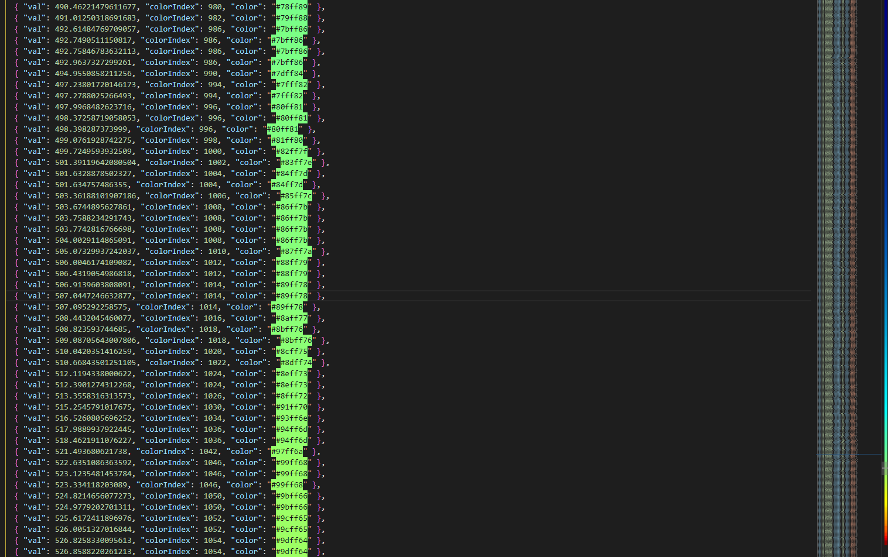

# Summary

A way to corolate a set of values with corresponding colors on a jet colormap.

In brief:

    Given an array of dataItems with the value 'zValue', ascribe each dataItem a 'color'
    value that reflects their relative position in the range of 0 to zMax (arbitrary)
    with respect to a jet colormap.

# What do

- npm install (colormap and fs)
- get extensions "prettier" (for formatting on save) and "Color Highlight" (for observation)
- go to setup.js and set your variables of interest
- npm run gen
- open "itemColors.json"
